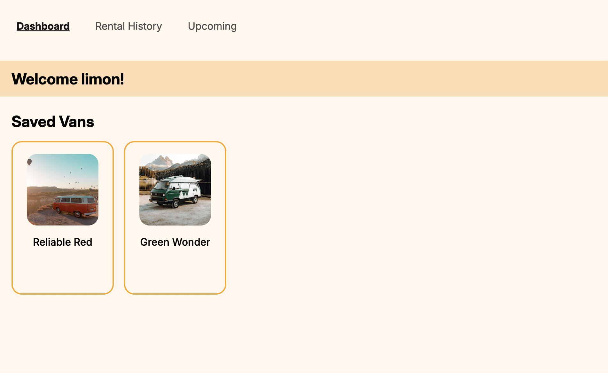

## 🚐 Van Life App
Van Life is a full‑stack van rental management platform where users can browse vans, save favorites, and book rentals, while hosts can manage their vans and track ratings.

Van Life began as a guided project from the [Scrimba Frontend Developer Career Path](https://scrimba.com/frontend-path-c0j) In the course, I built out the UI/UX for login, registration, van listings, and a host’s dashboard, originally using Firebase as the backend service. From there, I significantly expanded the project by introducing a custom Flask and MongoDB backend and implementing additional features:
* Integrated Chart.js in the host dashboard to visualize van ratings.
* Introduced user roles during registration (host or non‑host).
* Added features for non-host users:
    * Save and unsave vans, 
    * Book vans with specific date ranges,
    * View upcoming rentals and rental history.

**See Demo Here**: [Van Life App](https://van-life-gold.vercel.app/)

### Selected Screens
* Home Page /

This is what the home page looks like. You can browse all the vans by clicking on the "Find your van" button. You can also sign in by clicking on the profile icon in the dashboard. 

* Vans /vans

This page lets users browse through all the vans option listed without needing authentication.

* View vans by filter /vans?type=rugged

While viewing vans, users can browse vans that belong to a certain type

* Host dashboard view 
Here are some screens from a host's dashboard
* /host 

* /host/income

* /host/reviews

* User dashboard view /{username}

* rent and save vans /vans/{van_id}

* see upcoming rentals /{username}/upcoming_rental

### Future Improvements 
* Replace hardcoded data (review data and host income data) with actual aggregated data from users and rentals.
* Implement additional endpoints so hosts can manage their vans and view/edit incoming rentals.
* Add a map-based search feature allowing users to search for vans by location.